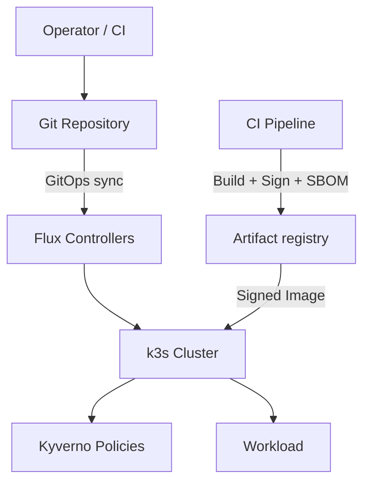

# Architecture

This diagram shows the control path Foundations is built around: Git defines desired state, Flux reconciles it, the cluster enforces policy, and signed images enter through an approved registry path.

## Components

- `k3s`: Single‑node Kubernetes
- `Flux`: GitOps controllers
- `Kyverno`: Policy enforcement and image verification
- `Cosign`: Signing and verification
- `Syft`: SBOM generation

## What This Diagram Clarifies

- Git is the system of record for desired state
- Flux applies that state inside the cluster rather than through ad hoc manual changes
- Kyverno enforces baseline controls before workloads run
- Registry, CI, and signing are part of the control story, not separate concerns

## Pipeline And Sovereignty Notes

- CI can run in GitHub Actions for default demos, but sovereign deployments should prefer self-hosted runners in the customer's approved jurisdiction.
- Defaults use a public base image (`nginx` from Docker Hub) in examples; production workloads should use **your** registry and signed images, optionally mirrored in-jurisdiction.
- Keep signing keys outside hosted CI when required (customer KMS/HSM or equivalent controlled key store).

## Related Docs

- [Overview](overview.md)
- [Stack](stack.md)
- [Pipeline Sovereignty](pipeline-sovereignty.md)
- [Supply Chain](supply-chain.md)
